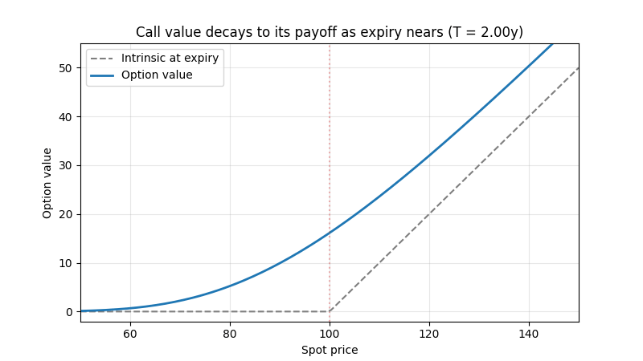
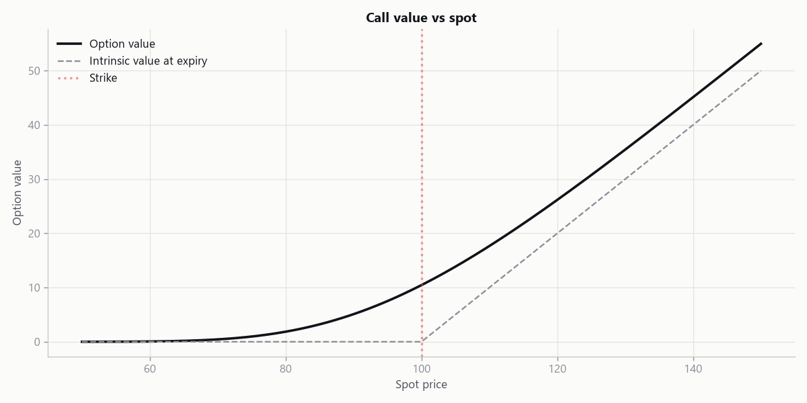
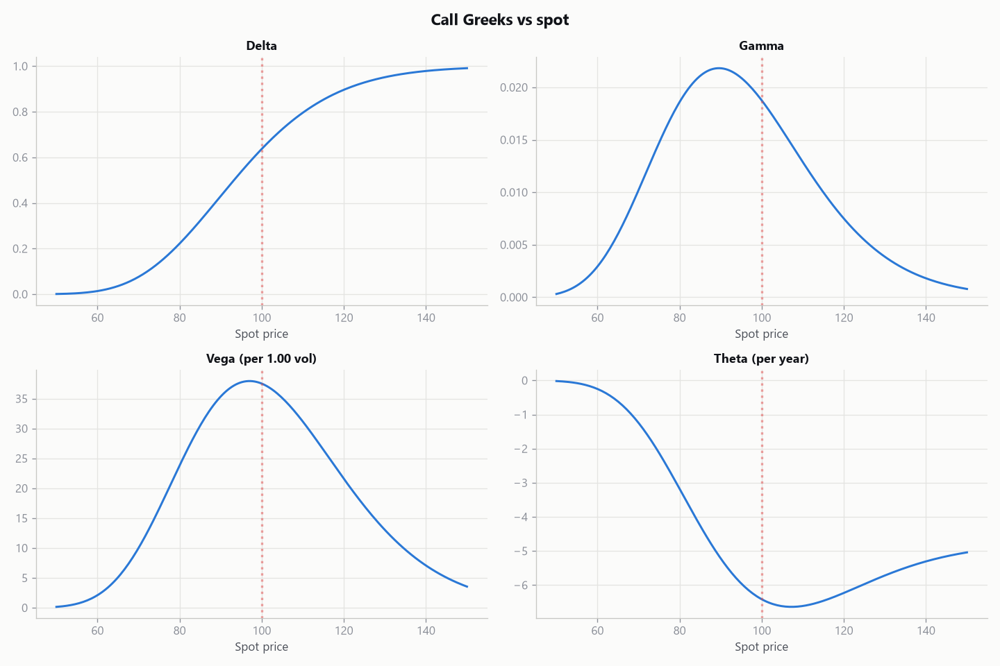

# Options Pricing (Black-Scholes)

Live: https://kelsonlam.github.io/options-pricing/


A from-scratch implementation of the Black-Scholes-Merton model: it prices
European calls and puts, computes all five Greeks analytically, backs implied
volatility out of a market price, and cross-checks every price against an
independent Monte Carlo simulation.

The formula is short. The interesting part, and the part this repo leans into,
is understanding what each piece means and where the model quietly stops
describing the real world.

## What it does

- **Prices** European calls and puts, with support for a continuous dividend
  yield.
- **Greeks**, all analytic: delta, gamma, vega, theta, and rho. Analytic
  derivatives are both exact and far cheaper than bumping an input and
  re-pricing.
- **Implied volatility**, solved from a market price with Newton-Raphson and a
  bisection fallback so it stays robust when vega is tiny.
- **Monte Carlo cross-check**, a completely separate price estimate. If the
  closed form and the simulation agree, that is strong evidence the code is
  right.

No SciPy dependency: the normal distribution comes from Python's standard
library `statistics.NormalDist`.

## Try it live

The calculator above is live at https://kelsonlam.github.io/options-pricing/
(source: [`docs/index.html`](docs/index.html)). Drag the sliders and watch the
price, the Greeks, and the value curve update in real time, using the same
maths as the Python library in this repo.

## Example output

This animation shows the idea time decay captures: a call's value sits above its
payoff when there is time left, and collapses onto the kinked intrinsic line as
expiry approaches.



The static charts below come straight from the plotting code in this repo (a
call with strike 100, one year to expiry, 5% rate, 20% volatility).

The value curve sits above the kinked intrinsic payoff. The gap between them is
time value, and it is largest at the money:



The Greeks show the shapes every options trader carries in their head: delta is
an S-curve, gamma and vega peak at the money, and theta (time decay) bites
hardest near the strike:



## The formula, briefly

For spot `S`, strike `K`, time to expiry `T`, rate `r`, dividend yield `q`, and
volatility `sigma`:

```
d1 = (ln(S / K) + (r - q + sigma^2 / 2) * T) / (sigma * sqrt(T))
d2 = d1 - sigma * sqrt(T)

Call = S * e^(-qT) * N(d1) - K * e^(-rT) * N(d2)
Put  = K * e^(-rT) * N(-d2) - S * e^(-qT) * N(-d1)
```

`N` is the standard normal CDF. `N(d2)` is, under the risk-neutral measure, the
probability the call finishes in the money. That probabilistic reading is the
intuition worth keeping.

## Getting started

```bash
git clone https://github.com/KelsonLam/options-pricing.git
cd options-pricing
pip install -r requirements.txt
python scripts/price_option.py --spot 100 --strike 100 --t 1 --r 0.05 --sigma 0.20
```

Add `--type put` for a put, `--mc` to print the Monte Carlo cross-check, and
`--save-plots` to write the charts.

## A note on the Greeks' units

Two of the Greeks are usually rescaled before they are quoted on a desk, and
this code returns the raw figures so the choice is explicit:

- **Vega** is returned per 1.00 change in volatility (100 percentage points).
  Divide by 100 for the more familiar "per 1% vol" number.
- **Theta** is returned per year. Divide by 365 for the per-calendar-day decay.

## Where the model stops describing reality

This is the part that matters more than the code. Black-Scholes is a model, and
every one of its assumptions is wrong in a specific, knowable way.

- **Constant volatility.** The single biggest one. The model assumes one
  volatility for all strikes and expiries, but real option prices imply
  different volatilities across strikes (the "volatility smile" or "skew").
  That the market disagrees with the model's central assumption is why implied
  volatility, not price, is the language traders actually use.
- **Lognormal returns, no jumps.** Prices are assumed to diffuse smoothly.
  Real markets gap and crash. The model therefore understates the odds of
  extreme moves and tends to misprice deep out-of-the-money options.
- **European exercise only.** These formulas assume exercise at expiry. They do
  not price the early-exercise right of American options, which needs a lattice
  or a numerical method.
- **Frictionless, continuous hedging.** No transaction costs, no bid-ask
  spread, and the ability to rebalance a hedge continuously. Real hedging is
  discrete and costly, which is a large part of why options do not trade exactly
  at their theoretical value.
- **Constant, known rate and dividend yield.** Both are assumed flat and
  certain over the life of the option.

The right way to read a Black-Scholes price is as a disciplined baseline and a
common language, not as the "true" value. Knowing where it breaks is what makes
it useful.

## American options via a binomial tree

Black-Scholes only prices European options. `binomial.py` adds a
Cox-Ross-Rubinstein tree that also handles American early exercise, and it
converges to the Black-Scholes price for European options (a test pins that
down).

```python
from options_pricing.binomial import binomial_price
binomial_price(100, 100, 1, 0.05, 0.20, "put", american=True)
```

## Tests

```bash
pip install pytest
pytest
```

The suite checks a known textbook value, put-call parity, that the price rises
with volatility, the Greek sign and bound constraints, that implied volatility
recovers the volatility it was priced with, and that the Monte Carlo estimate
lands within a few standard errors of the closed form.

## Project layout

```
options-pricing/
├── requirements.txt
├── scripts/
│   └── price_option.py
├── src/options_pricing/
│   ├── black_scholes.py
│   ├── greeks.py
│   ├── implied_vol.py
│   ├── montecarlo.py
│   └── plotting.py
└── tests/
    └── test_pricing.py
```

## License

MIT. See [LICENSE](LICENSE).
